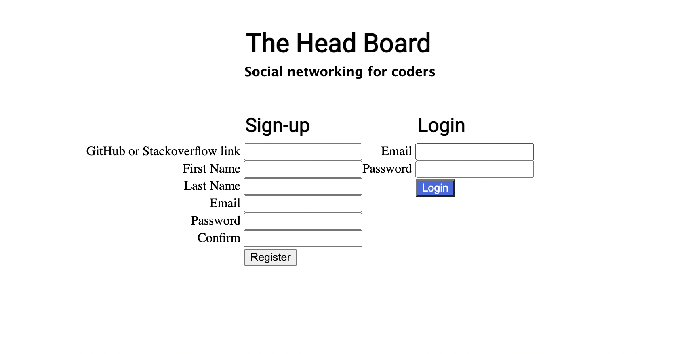
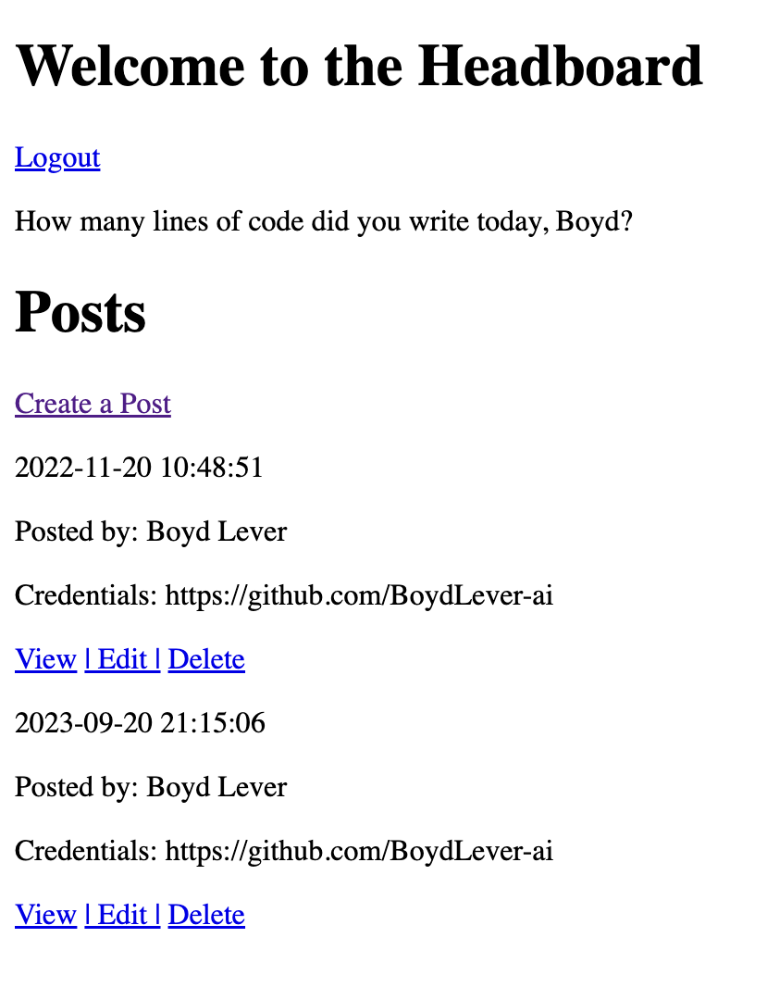
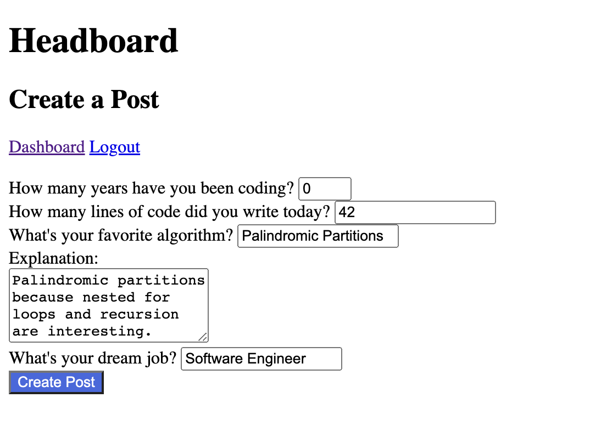
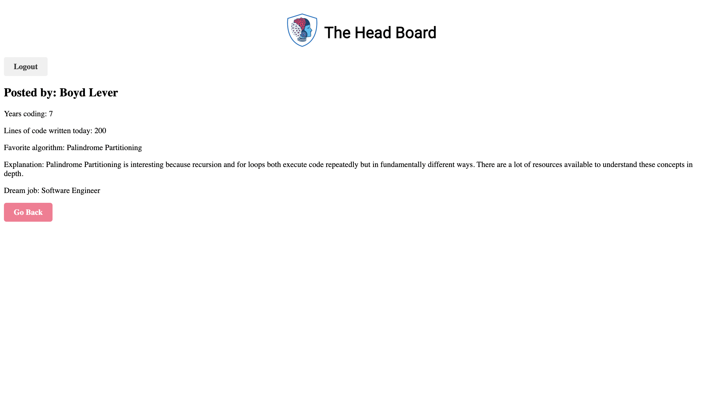
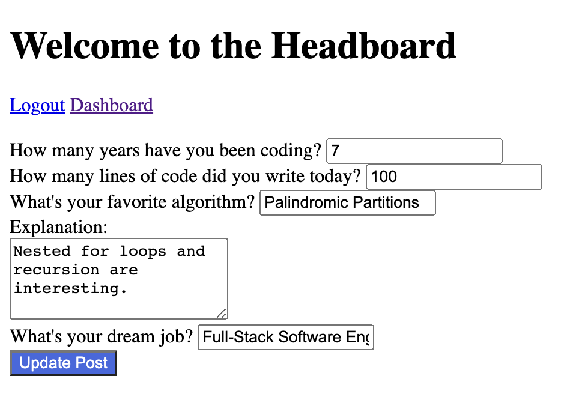

# Introduction

HeadBoard is a a secure social networking web application where software engineers can create posts about their favorite code, algorithms and career aspirations. I built this fully-functional project with Python and Flask. HeadBoard requires users to create an account with an email as well as GitHub or Stackoverflow account. Users' passwords are encrypted and stored in a local MySQL database. Once registered, users can login and create posts. Users are allowed to update, view and delete their posts, which are displayed by date and time in a dashboard.  

# Prerequisites

- Python 3.10.8
- Flask 2.2.2
- MySQL Database 8.0.22

# Installation & Setup

### 1. Clone the repository:  
`git clone [HeadBoard URL]`  
### 2. Navigate to the directory:  
`cd HeadBoard`  
### 3. Install prerequisites:  
- https://www.python.org/downloads/  
- https://flask.palletsprojects.com/en/2.3.x/installation/  
- https://dev.mysql.com/doc/mysql-installation-excerpt/5.7/en/  
### 4. Run HeadBoard using the terminal command:  
`python server.py`  

# Features  
### Secure Login & Registration  
  
### Dashboard that shows the User's Posts  
  
### Create-A-Post 
  
### View Post 
  
### Edit Post  
  

# Screen Recording
  
