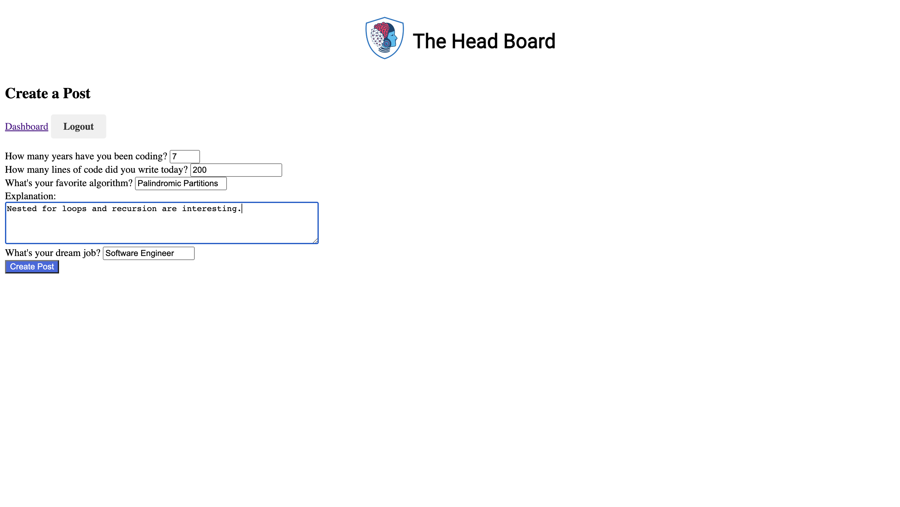

# HeadBoard
A secure social networking web application where developers post their favorite code snippets, built using Python and Flask
# Screenshots
### Login & Registration Page  
  
### Dashboard that shows the User's Posts  

### Create-A-Post Feature  

### View-Post Feature  

### Update-Post Feature

