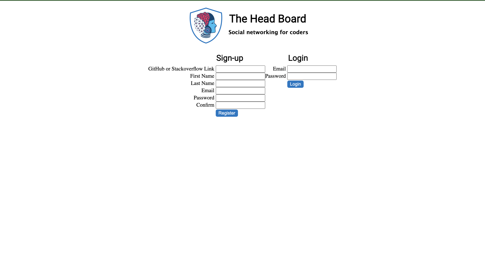
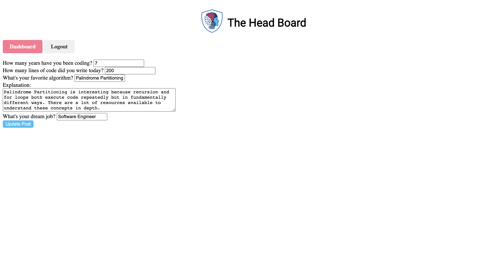

## Introduction

HeadBoard is a a secure social networking web application where web developers can create posts about their favorite code, algorithms and career aspirations. I built this fully-functional project with Python and Flask. HeadBoard gives users the ability to create an account with their GitHub or Stackoverflow credentials, and their email address. Once registered, users can login and create posts. Users can then update, view and delete their posts, which are documented by date and time in a dashboard.  

# Screenshots  
### 1. Login & Registration Page  
  
### 2. Dashboard that shows the User's Posts  
  
### 3. Create-A-Post Feature  
  
### 4. View-Post Feature  
  
### 5. Update-Post Feature  
  
